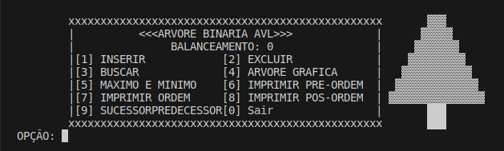

#TP01-ALGORITMOS-E-ESTRUTURA-DE-DADOS-II

#ESTE REPOSITÓRIO FOI CRIADO COM O INTUITO DE FACILITAR A COLABORAÇÃO ENTRE OS ALUNOS NA DISCIPLINA DE ALGORITMOS E ESTRUTURA DE DADOS II, REFERENTE AO TRABALHO PRÁTICO 01 DE PESQUISA E RESOLUÇÃO DE PROBLEMAS ENVOLVENDO ÁRVORES BINÁRIAS BALANCEADAS (AVL).

#ABAIXO ESTÁ INTERFACE INICIAL DO ALGORITMO CONTENDO AS FUNCIONALIDADES BASICAS DE INSEÇÃO, REMOÇÃO, BUSCA, IMPRESSÃO EM PRE-ORDEM, POS-ORDEM E EM ORDEM, ALEM DE UMA IMPRESSÃO GRAFICA DA ARVORE, TAMBEM POSSUI A OPÇÃO DE MOSTRAR O MENOR E MAIOR ELEMENTO E POR FIM MOSTRAR O PREDECESSOR E SUCESSOR:

